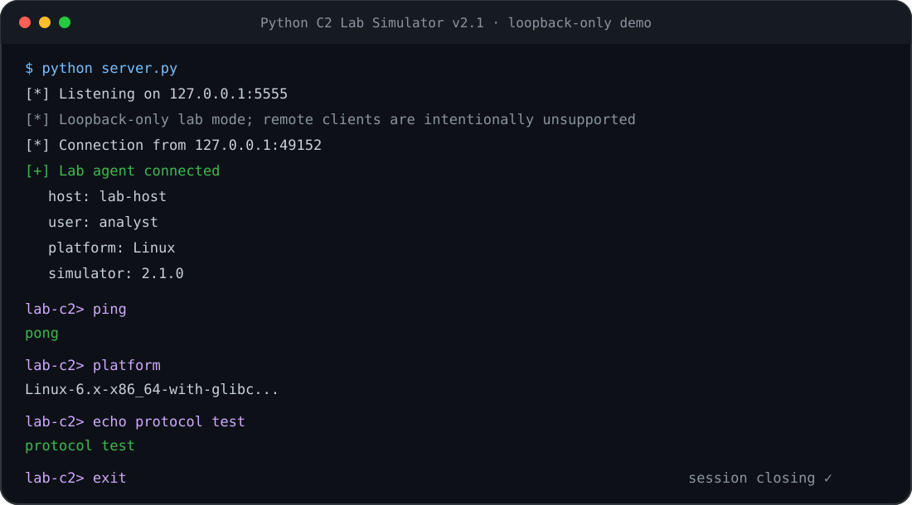
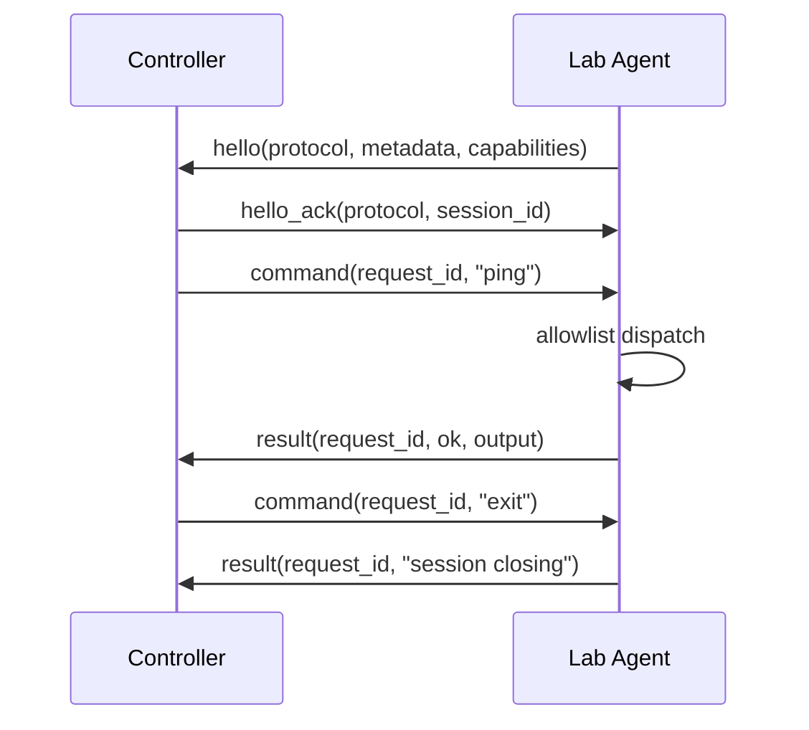

# Python Red Team C2 Lab Simulator

A dependency-free Python lab that demonstrates the protocol and session mechanics behind a controller/agent architecture without providing an unrestricted remote shell.


## Overview

Version **2.1** turns the original reverse-shell proof of concept into a deliberately constrained, loopback-only protocol simulator for coursework, protocol analysis, detection engineering exercises, and local lab demonstrations.

The project keeps the useful engineering concepts:

- controller/agent architecture
- TCP session establishment
- structured handshake metadata
- capability negotiation
- length-prefixed JSON framing
- request/response correlation
- explicit command dispatch
- protocol validation and error handling
- graceful shutdown
- automated unit and integration tests
- CI linting, formatting checks, multi-version tests, and branch coverage

It intentionally does **not** provide:

- arbitrary shell execution
- `subprocess` command execution
- persistence
- credential access
- file transfer
- remote deployment
- stealth or evasion
- exploitation
- internet-facing listeners

Both sides are fixed to `127.0.0.1`. The controller also validates the agent capability list against its own local allowlist before sending commands.

## Demo



An asciinema-compatible recording is also included at [`docs/demo.cast`](docs/demo.cast).

## Architecture



Messages use a 4-byte big-endian length prefix followed by a UTF-8 JSON object:

```text
+----------------------+------------------------+
| 4-byte length (BE)   | UTF-8 JSON payload     |
+----------------------+------------------------+
```

Protocol v2 limits frames to **64 KiB**, rejects zero-length frames, duplicate JSON keys, malformed UTF-8/JSON, non-object top-level values, oversized frames, and malformed request identifiers.

See [`docs/PROTOCOL.md`](docs/PROTOCOL.md) for the message schema and state flow.

## Safe command set

The agent supports only this explicit allowlist:

| Command | Purpose |
| --- | --- |
| `help` | Show available simulator commands |
| `ping` | Verify agent responsiveness |
| `hostname` | Return local hostname |
| `whoami` | Return current local user |
| `cwd` | Return current working directory |
| `platform` | Return platform information |
| `python` | Return Python version |
| `time` | Return UTC time |
| `echo <text>` | Echo up to 256 characters |
| `exit` | Close the session |

Unknown commands are rejected by the controller and the agent. There is no shell fallback.

The command line is limited to 512 characters and NUL bytes are rejected.

## Requirements

- Python 3.11+
- No third-party runtime packages

Ruff and coverage.py are used only in development/CI.

## Run the lab

Open two terminals.

Controller:

```bash
python server.py
```

Agent:

```bash
python agent.py
```

Optional custom loopback port:

```bash
python server.py --port 6000
python agent.py --port 6000
```

Version information:

```bash
python server.py --version
python agent.py --version
```

## Project structure

```text
.
├── agent.py
├── commands.py
├── protocol.py
├── server.py
├── pyproject.toml
├── SECURITY.md
├── CHANGELOG.md
├── docs/
│   ├── PROTOCOL.md
│   ├── RELEASE_NOTES_v2.1.0.md
│   ├── demo.cast
│   └── assets/
│       └── demo.svg
├── tests/
│   ├── test_agent.py
│   ├── test_cli_session.py
│   ├── test_commands.py
│   ├── test_protocol.py
│   └── test_server.py
└── .github/
    └── workflows/
        └── ci.yml
```

### `protocol.py`

Implements length-prefixed JSON transport, bounded frame sizes, exact socket reads, duplicate-key rejection, serialization checks, and request ID validation.

### `commands.py`

Contains the explicit command allowlist, command/input limits, help text, and local agent metadata. No arbitrary command execution path exists.

### `agent.py`

Connects only to `127.0.0.1`, performs the versioned handshake, validates session metadata, dispatches allowlisted commands, and echoes the controller request ID in every result.

### `server.py`

Binds only to `127.0.0.1`, validates the handshake and reported capabilities, correlates every response with its request ID, and rejects unsupported commands before sending them.

## Testing and quality gate

Run the full suite:

```bash
python -m unittest discover -s tests -v
```

Compile check:

```bash
python -m compileall -q .
```

Local lint/format checks:

```bash
python -m pip install ruff
ruff check .
ruff format --check .
```

Branch coverage:

```bash
python -m pip install coverage
coverage run -m unittest discover -s tests -v
coverage report
```

CI enforces a **90% minimum branch-coverage gate**. The v2.1 release-prep baseline measured **91.8%** overall branch coverage, with `protocol.py` at **100%**. CI also publishes a downloadable HTML coverage report artifact for each run.

Tests cover:

- framing round trips
- invalid UTF-8 and malformed JSON
- duplicate JSON keys
- truncated and oversized frames
- request ID validation and session binding
- command allowlisting and input limits
- agent/controller handshake validation
- controller-side capability validation
- request/response correlation
- clean session termination
- CLI/runtime success and error paths

Integration tests use `socket.socketpair()` and never reach an external network.

## Detection-engineering value

Because the protocol is intentionally deterministic and local, it can be used as a benign traffic source for:

- packet-capture exercises
- message-framing analysis
- IDS/SIEM lab rules
- protocol parser development
- state-machine exercises
- teaching the separation between transport, protocol, and command execution

## Design decisions

**Loopback-only by design**  
The controller and agent are fixed to `127.0.0.1`. This keeps the project useful for local research while avoiding an internet-capable C2 implementation.

**Two-sided allowlisting**  
The agent dispatches only explicit commands, and the controller validates the capability list and refuses unsupported commands before transmission.

**Bounded protocol input**  
Frames, request IDs, commands, metadata, and echoed text have explicit limits. The parser fails closed on malformed input.

**Request correlation**  
Protocol v2 associates each command/result pair with a request ID so unexpected or out-of-order responses are detected instead of silently accepted.

**Standard library runtime**  
The simulator uses Python's standard library only. Ruff and coverage.py are development-time quality tools, not runtime dependencies.

## Limitations

This is intentionally a simulator, not a production remote-management or red-team framework. It supports one local agent and a deliberately small command vocabulary.

It does not provide transport encryption because traffic never leaves loopback. If the project were ever redesigned for non-loopback networking, authentication and authenticated encryption would be prerequisites rather than optional extras.

## Security

See [`SECURITY.md`](SECURITY.md) for the project's security boundaries and vulnerability-reporting guidance.

## Release notes

Prepared v2.1.0 release notes are available in [`docs/RELEASE_NOTES_v2.1.0.md`](docs/RELEASE_NOTES_v2.1.0.md).

## Legal and ethical use

Use this project only for local lab work, education, defensive research, and systems you are explicitly authorized to test.

## License

MIT. See [LICENSE](LICENSE).
