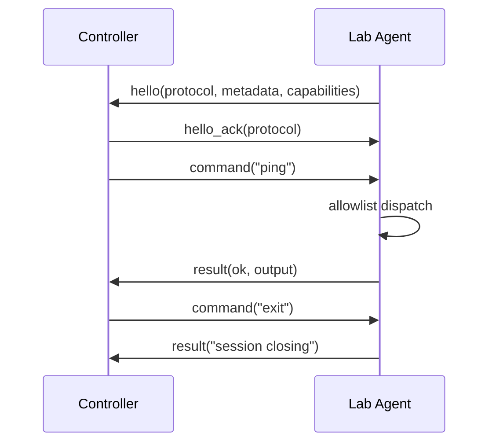

# Python Red Team C2 Lab Simulator

A small, dependency-free Python project that demonstrates the **protocol and session mechanics** behind a command-and-control architecture without providing an unrestricted remote shell.


## Overview

The original repository was a minimal reverse-shell proof of concept. Version 2.0 refocuses it into a safer **loopback-only C2 protocol simulator** suitable for coursework, protocol analysis, detection engineering exercises, and local lab demonstrations.

It still demonstrates the interesting engineering parts:

- controller/agent architecture
- TCP session establishment
- structured handshake metadata
- length-prefixed message framing
- JSON serialization
- command dispatch
- capability negotiation
- clean session shutdown
- protocol validation and error handling
- automated unit/integration tests

What it intentionally does **not** provide:

- arbitrary shell execution
- `subprocess` command execution
- persistence
- credential access
- file transfer
- remote deployment
- stealth or evasion
- exploitation
- internet-facing listeners

Both sides are pinned to `127.0.0.1`, making the project a local protocol lab rather than an operational C2.

## Architecture



Messages use a simple framing format:

```text
+----------------------+------------------------+
| 4-byte length (BE)   | UTF-8 JSON payload     |
+----------------------+------------------------+
```

The frame limit is 1 MiB and malformed frames are rejected.

## Safe command set

The agent supports only a small explicit allowlist:

| Command | Purpose |
| --- | --- |
| `help` | Show available simulator commands |
| `ping` | Verify agent responsiveness |
| `hostname` | Return local hostname |
| `whoami` | Return current local user |
| `cwd` | Return current working directory |
| `platform` | Return platform information |
| `python` | Return Python version |
| `time` | Return UTC time |
| `echo <text>` | Echo supplied text |
| `exit` | Close the session |

Unknown commands are rejected. There is no shell fallback.

## Requirements

- Python 3.11+
- No third-party packages

## Run the lab

Open two terminals.

Controller:

```bash
python server.py
```

Agent:

```bash
python agent.py
```

Optional custom loopback port:

```bash
python server.py --port 6000
python agent.py --port 6000
```

Example session:

```text
[*] Listening on 127.0.0.1:5555
[*] Loopback-only lab mode; remote clients are intentionally unsupported
[*] Connection from 127.0.0.1:49152
[+] Lab agent connected
    host: lab-host
    user: analyst
    platform: Linux
    type 'help' for supported simulator commands

lab-c2> ping
pong
lab-c2> platform
Linux-6.x-x86_64-with-glibc...
lab-c2> echo protocol test
protocol test
lab-c2> exit
session closing
```

## Project structure

```text
.
├── agent.py
├── commands.py
├── protocol.py
├── server.py
├── tests/
│   ├── test_agent.py
│   ├── test_commands.py
│   └── test_protocol.py
└── .github/
    └── workflows/
        └── ci.yml
```

### `protocol.py`

Implements the length-prefixed JSON transport. It handles partial TCP reads, frame-size validation, UTF-8 decoding, and protocol errors.

### `commands.py`

Contains the explicit command allowlist and agent metadata. No arbitrary command execution path exists.

### `agent.py`

Connects only to `127.0.0.1`, performs the protocol handshake, dispatches allowlisted commands, and returns structured results.

### `server.py`

Binds only to `127.0.0.1`, accepts one lab agent, performs the handshake, and exposes a small interactive controller prompt.

## Testing

Run the complete test suite:

```bash
python -m unittest discover -s tests -v
```

Compile-check the project:

```bash
python -m compileall -q .
```

The tests cover:

- protocol framing
- invalid frame rejection
- command allowlisting
- argument validation
- controller/agent handshake
- request/response flow
- clean session termination

The integration test uses `socket.socketpair()` and never reaches the network.

## Detection-engineering value

Because the protocol is intentionally simple and deterministic, it is useful as a benign source of traffic for:

- packet-capture exercises
- message-framing analysis
- simple IDS/SIEM lab rules
- controller/agent state-machine exercises
- protocol parser development
- teaching the difference between transport, protocol, and command execution

## Design decisions

**Loopback-only by design**  
The controller and agent are fixed to `127.0.0.1`. This keeps the project useful for local research while avoiding an internet-capable C2 implementation.

**No shell execution**  
Commands are mapped to Python functions through an explicit allowlist. Unsupported input fails closed.

**Standard library only**  
The project uses only Python's standard library, including `socket`, `json`, `struct`, `argparse`, and `unittest`.

**Length-prefixed framing**  
TCP is a byte stream, not a message protocol. A fixed-size header avoids the common mistake of assuming one `recv()` call equals one complete application message.

## Limitations

This is intentionally a simulator, not a production remote-management or red-team framework. It supports one local agent and a deliberately small command vocabulary.

## Legal and ethical use

Use the project only for local lab work, education, defensive research, and systems you are authorized to test.

## License

MIT. See [LICENSE](LICENSE).
